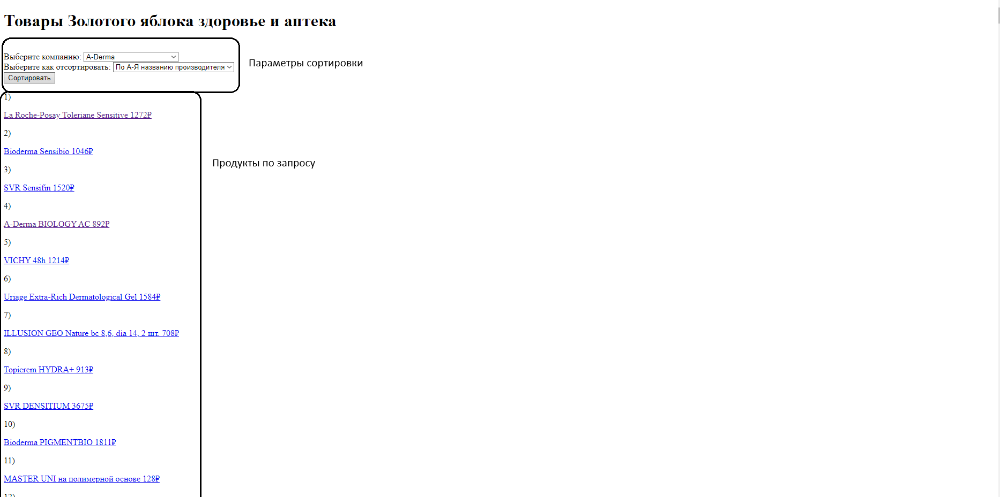

# Energy

## О программе

Программа считывает продукты с сайта https://goldapple.ru/aptechnaja-kosmetika откуда берёт компанию, название, цену и 
ссылку на продукт и записывает их в базу данных. Просмотреть и отсортировать их можно на сайте.

## Инструкция по запуску

Клонируем проект и в папке проекта запускаем консоль. В ней запускаем команду: 

```sh
docker-compose up --build
```

После установки нужных компонентов и запуска нужно перейти на http://127.0.0.1:5000 или http://localhost:5000 (они могут не сразу загрузиться и нужно подождать пока парсер обработает сайт золотого яблока)

## Инструкция по сайту

Для начала нужно установить нужные параметры для сортировки и нажать кнопку Сортировать

Далее у нас появляются все продукты по нашемы запросу, которые являются ссылками на них
